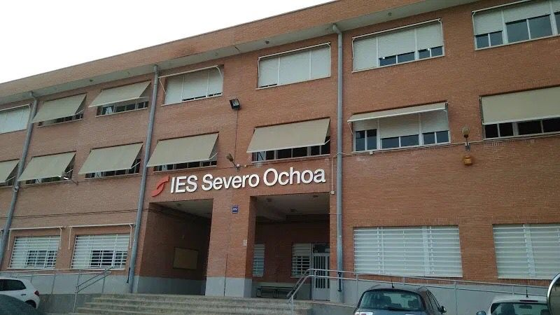

# Jose Mora

## ¿Quién soy?

Soy un estudiante de segundo de Daw, que además de ser una **máquina**, estoy aprendiendo *markdown* y **Github pages**.

Mi instituto es el [Severo Ochoa en Elche](https://www.fpelx.es/wp-content/uploads/2021/02/WhatsApp-Image-2021-05-21-at-20.30.246.jpeg)



## ¿Qué estoy aprendiendo?

Me gusta programar en Python:
``` python

aficiones = ["dar clase de interfaces","dormir la siesta"]
print(aficiones)
```

Un comando que no hay que olvidar es `python manage.py runserver`, y siempre se me olvida.

Otras tecnologías que he aprendido han sido:

* SQL
* Java Básico
    1. Clases
    1. Colecciones
    1. Ficheros
* HTML y CSS
    * HTML 5
* JavaScript
    * Arrays
* Python

Y los módulos que me han gustado han sido:

| Sí    |   No
| ----  | ---- |
| BD    |   Programación    |
| Desarrollo en Servidor    |   Diseño De Interfaces    |


## ¿Dónde encontrarme?

Me puedes encontrar en twitter [@86jamg](www.twitter.com/86jamg@gmail.com) y por correo en [86jamg@gmail.com](mailto:86jamg@gmail.com).